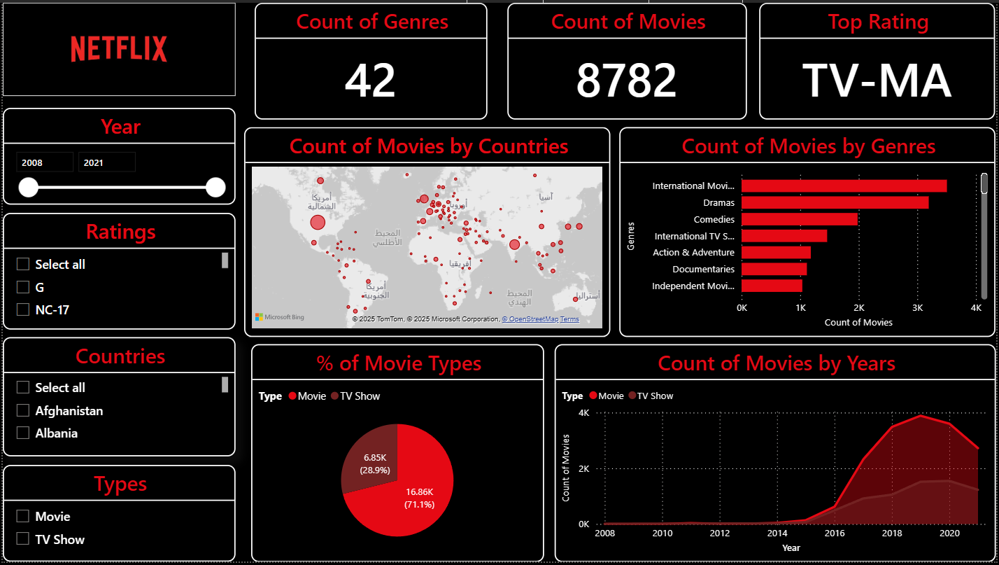

# Netfliex_Movies_Analysis
This project focuses on exploring and analyzing a dataset of Netflix movies and TV shows to uncover insights about content distribution, trends, and patterns. Using Python (Pandas, NumPy, Matplotlib, Seaborn) and Power BI, the project applies data cleaning, exploratory data analysis (EDA), and visualization techniques to answer key questions about Netflix’s content strategy.

----

## Data Preprocessing

Data Cleaning

  - Handling missing values and duplicates.

  - Splitting multi-country fields into separate values.

  - Standardizing text (removing extra spaces, formatting categories).

Exploratory Data Analysis (EDA)

  - Distribution of movies vs. TV shows.

  - Content trends over the years (growth of Netflix library).

  - Most common genres, ratings, and countries.

  - Top directors and actors appearing frequently.

Data Visualization

  - Interactive Power BI dashboard for filtering and exploring insights.

  - Charts showing genre popularity, release year trends, and global reach.

-----

## Dashbaord:

-----

## Key Insights
- The number of TV shows has grown rapidly compared to movies in recent years.

- Certain genres like Drama and Comedy dominate Netflix’s catalog.

- The USA and India are the top contributors to Netflix content.

----

## Tools & Technologies

| Category         | Tools                         |
| ---------------- | ----------------------------- |
| Language         | Python                        |
| Data Processing  | pandas, NumPy                 |
| Visualization    | Matplotlib, Seaborn, Power BI |
